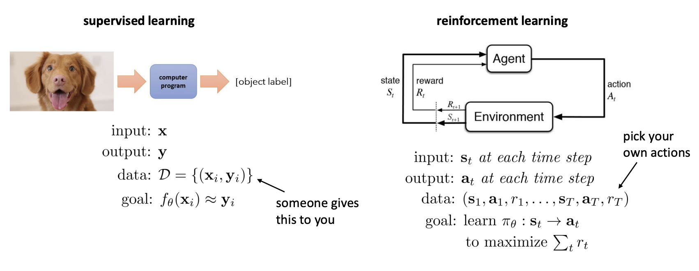
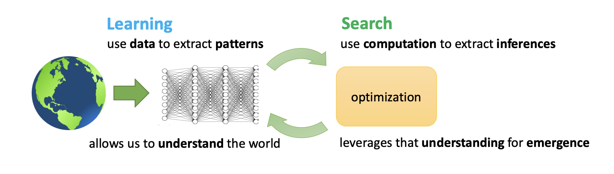

Addison Kalanther (addikala@berkeley.edu)

# Lecture 1: Introduction to Course

The topic of this class is reinforcement learning, a type of machine learning whose primary goal is to maximize a reward function. This is different from supervised machine learning, whose goal is to more-or-less replicate what it sees given a large dataset.

## Why reinforcement learning?

Take a robot with a claw whose task is to pick up various objects from a bin. Two approaches one might take in the absence of RL is to

1. Design an algorithmic solution by understanding a problem and its dynamics.
   - This is difficult as we would need to account for the shapes of many different types of objects and individually analyze them.
2. Set it up as a supervised learning problem.
   - We would need to collect data for many different types of objects, manually setting the claw stance for each of them.

Rather than analyze or gather data, what if we let the robot learn the optimal movement and stance for a given task by only giving it a signal of whether or not it successfully completed the task?

This is what reinforcement learning tries to do. Rather than show an agent how to complete a task, whether algorithmically or through data, it lets the **agent** learn what to do by letting it explore various methods in its **environment** and indicating whether it's doing the task successfully.

This is done through a **reward** function, a scalar function that indicates how well an agent is doing. For example, in our previous robot example, an example reward function is $1$ if the object is picked up and $0$ if it is not.

### Putting it all together (a comprehensive example)

Consider a dog that you are trying to teach to go through a course for a time-trial competition. The dog would be the agent, and the course would be the environment. An example reward function for this case would be treats when it successfully completes the course. To account for the time-trial nature of the task, you might scale the treats with how quickly the dog completes the task. Let the dog run around the course, and with enough time, it will eventually learn that the faster it completes the course, the more treats it will get. This will incentivize the dog to do faster and faster, optimizing its pathing and movement for more treats. Rather than telling it what to do, we allow the dog to figure it out itself, giving it the opportunity to find a better solution than we can ourselves. This process of exploration and reward is what is at the heart of reinforcement learning.

## Differences in supervised ML and RL

There are a few important differences between the two.

1. Independent and identically distributed (i.i.d) assumption
   - Assumed in supervised ML, not assumed in RL. This means previous outputs influence future inputs.
2. Ground truth known
   - Ground truth outputs are assumed to be known in supervised ML. This is not known in RL. Instead, we only know the reward.

### A good visual

## Why deep reinforcement learning?

Reinforcement learning allows for agents to learn novel and complex solutions. However, it ignores the benefits of large datasets and advances in machine learning models. By utilizing deep neural networks and data for reinforcement learning, we can leverage what we know as a basis and allow an agent to discover optimal solutions. This is known as deep RL.

1. Deep = scalable learning from large, complex datasets
   - use data to extract patterns
   - use our understanding of the world
2. Reinforcement learning = optimization
   - use computation to extract **inferences** (optimal actions)
   - leverages understanding for **emergence** (novel solutions)

### What challenges remain?

Although we have great methods that can learn from large amounts of data and great methods for optimization methods in RL, **we do not have amazing methods that both use data and RL**.

Some challenges...

1. Humans can learn quickly, RL methods learn very slowly.
2. Transfer learning (using past knowledge) is an open problem in RL.
3. Not always clear what the reward function should be.
4. Not always clear what the role of prediction should be.
