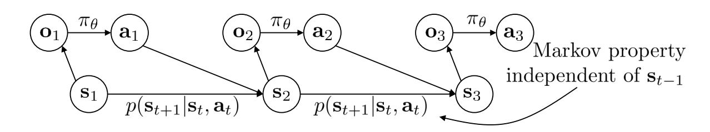
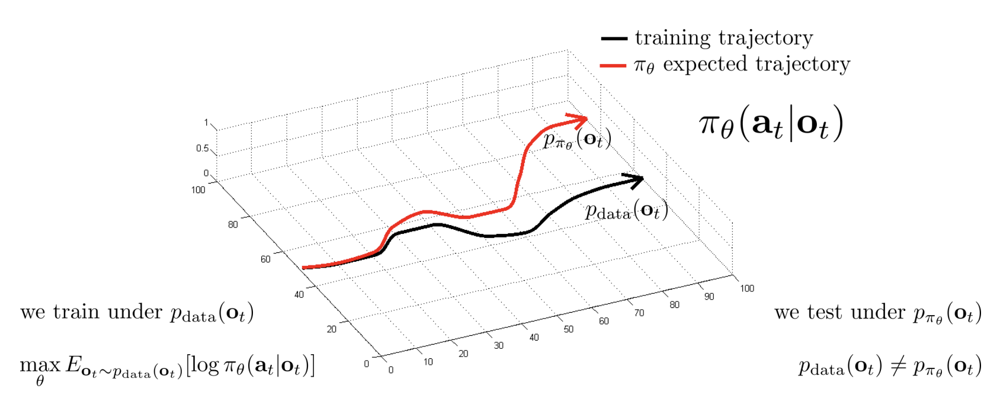
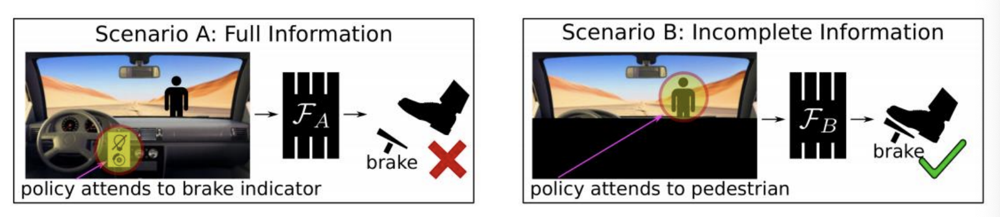
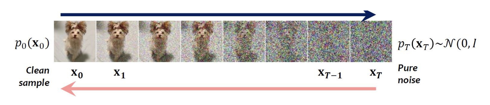
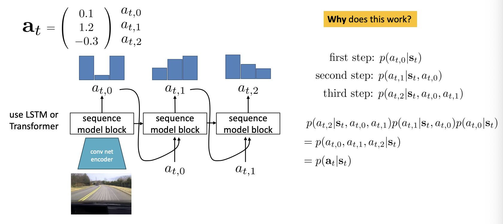

# Lecture 2: Imitation Learning

Imitation learning is the supervised learning of behaviors (this is not reinforcement learning). We allow an expert to complete the task successfully a large number of times, and then train off that data using standard supervised learning techniques (neural networks).

## Terminology and notation

In a given system, there is the state, observation, and action. An observation is a subset of the state, and the action is a result of the observation.

- $\textbf{s}_t$ - state

- $\textbf{o}_t$ - observation

- $\textbf{a}_t$ - action

- $\pi_\theta(\textbf{a}_t \mid \textbf{o}_t)$ - policy

- $\pi_\theta(\textbf{a}_t \mid \textbf{s}_t)$ - policy (fully observed)
  - _Note: many readings state $s_t$ when they mean $o_t$, usually doesn't make a difference._

The biggest difference in determining whether an RL algorithm that works for states also works observations is whether it assumes the markov property. States obey the markov property (state $s_t$ is independent given $s_{t-1}$), but observations do not have to.

## Deep imitation learning

The first deep imitation learning system using a neural network with video input of the current road view as input. **It did not work.**

### The distributional shift problem

The reason it did not work is because it did not account for **distributional shift**, or the phenomenon of the training distribution not matching the test distribution. This happens because we enter states during testing that we did not see while training. In other words, the probability of states in the training distribution does not match the probability of states in the testing distribution given the same observation ($p_{data}(\textbf{o}_t) \ne p_{\pi_\theta}(\textbf{o}_t)$).

### Why does this happen?

This happens because a fundamental assumption of supervised learning is broken. **Training samples are no longer i.i.d.** We collected samples $(\textbf{a}_t \mid \textbf{o}_t)$ from various paths and did not account for the fact that current observations depend on previous observations during training. This leads to incorrect actions chosen, and while the error might be small at first, error balloons as every small error compounds into a state even farther from what the current model has seen from the expert, leading to likelier and worse errors. This leads to the shift in distribution seen below.

## Analysis of distributional shift

### Bound in shift: $\sum_t E_{p_\theta(\textbf{s}_t)}[c_t] = O(\epsilon T^2)$

Given that our policy makes a mistake with probability $\epsilon$ given a state $\textbf{s}$ from our training distribution, the expected amount of mistakes made in a run given our test distribution is $O(\epsilon T^2)$, where T is our horizon (maximum number of steps in a singular path).

#### _Proof_

$$\text{assume } \pi_\theta(\textbf{a} \ne \pi^*(\textbf{s}) \mid \textbf{s}) \le \epsilon \textbf{ for all s} \in \mathcal{D}_{train} \textbf{ for } \textbf{s} \sim p_{train}(\textbf{s})$$
$$p_\theta(\textbf{s}_t) = (1 - \epsilon)^t p_{train}(\textbf{s}_t) + (1 - (1 - \epsilon)^t)p_{mistake}(\textbf{s}_t)$$

- $(1 - \epsilon)^t$ is the probability we make no mistakes (since $\epsilon$ is the probability we make a mistake at any given timestep according to our assumption)
- $p_{train}$ is training distribution
- $p_{mistake}$ is some other distribution (no assumptions)

$$\mid p_\theta(\textbf{s}_t) - p_{train}(\textbf{s}_t) \mid \ = (1 - (1 - \epsilon)^t) \mid p_{mistake}(\textbf{s}_t) - p_{train}(\textbf{s}_t) \mid \ \le 2(1 - (1 - \epsilon)^t) \le 2 \epsilon t$$

- $\mid p_{mistake}(\textbf{s}_t) - p_{train}(\textbf{s}_t) \mid \ \le 2$ because the absolute difference between two distributions with min and max value of 0 and 1 is two (think one distribution has states with non-zero probability where the other distribution has those same states with zero probability and vice-versa)
- **Useful identity: $(1 - \epsilon)^t \ge 1 - \epsilon t \text{ for } \epsilon \in [0, 1]$**

$$
\begin{align*}
  \sum_t E_{p_\theta(\textbf{s}_t)}[c_t] = \sum_t\sum_{\textbf{s}_t}p_\theta(\textbf{s}_t)c_t(\textbf{s}_t) &\le \sum_t \sum_{\textbf{s}_t}p_{train}(\textbf{s}_t)c_t(\textbf{s}_t) + \mid p_\theta(\textbf{s}_t) - p_{train}(\textbf{s}+t) \mid c_{max} \\
  &\le \sum_t \epsilon + 2 \epsilon \\
  &= O(\epsilon T^2)
\end{align*}
$$

For more analysis, see [Ross et al. "A Reduction of Imitation Learning and Structured Prediction to No-Regret Online Learning"](https://arxiv.org/abs/1011.0686) 

### Why is this pessimistic?

We can often recover from mistakes. By introducing mistakes in the training distribution and how to recover from these 'mistake' states through data.

## Alleviating distributional shift

There are methods we can use to alleviate distributional shift. Here are a few ways.

### Collecting / augmenting data

We experience distributional shift when our model sees states that it hasn't seen in its training distribution, often due to mistakes made prior by our policy. By intentionally adding mistakes to our training distribution, we introduce ways our model can recover from these mistake states.

- While mistakes do hurt our model, corrections often help more than the mistakes hurt.

We can also introduce fake mistakes that illustrates corrections via data augmentation. For example, side-facing cameras for a self-driving car will produce data that mimics a car going off road. We can match these cameras with the action of going in the direction of the road so that the policy learns to correct itself.

### Using very accurate models

We can use very powerful models that make very few mistakes. This requires addressing the issues of why our current model can't fit the expert policy.

#### Non-markovian behavior

Supervised learning models assume i.i.d data, meaning it assumes that our action is only dependant on our current observation ($\pi_\theta(\textbf{a}_t \mid \textbf{o}_t)$). However, in reality, our action could depend on all past observations ($\pi_\theta(\textbf{a} \mid {\textbf{o}_1, ..., \textbf{o}_t})$).

This means our model will do the same thing twice, regardless of the past actions / observations. This is very unnatural and most of the time not the case for human demonstrators.

We can alleviate this by including the whole history through sequential models, but this might work poorly due to _causal confusion_, or the phenomenon of the model tieing an action due to an effect of said action, rather than the true cause as determined by the expert.

See more in [Haan et al., "Causal Confusion in Imitation Learning"](https://arxiv.org/abs/1905.11979)

#### Multimodal behavior

Our distribution might be multimodal, leading to errors due to the assumption of unimodal behavior. We can alleviate this through more expressive continuous distributions or discretization.

For expressive continuous distributions, there are many options. Some popular ones are

- mixture of Gaussians
- latent variable models (e.g. [conditional] variational autoencoder)
- diffusion models (gradually introduce noise to clean sample and learn noise from noisy sample, continuously iterate on a pure noise sample to generate a clean sample)

The last two methods generate different likely actions given a randomized start point. This will be explored later in the course.

#### Discretization

Another way we can represent multimodal behavior is through discretization of dimensions for high dimensional action spaces (e.g. spaces that can represent a set of plausible actions). However, rather than discretize every possible high dimension action, which would result in exponential growth, discretize one dimension at a time using a sequential model (such as an LSTM or Transformer).

### Multi-task learning

We can use multi-task learning to alleviate distributional shift, as training for multiple tasks can introduce mistake stakes in one task that might have been dealt with in another task.

The way we train a multi-task agent is by leaning policy $\pi_\theta(\textbf{a}\mid \textbf{s}, \textbf{g})$. This is a policy whose action is conditioned on both the state and the goal; however, this incurs the additional problem of introducing distributional shift in goal states as well as action states.

#### _Aside: Learning to Reach Goals via Iterated Supervised Machine Learning_

An example of using multi-task learning is in a paper by RAIL is to start with a random policy and collect data with random goals. Then, we use this data as demonstrations for the goals that were reached, and we then use this to improve the policy.

### Using DAgger

DAgger stands for **D**ataset **A**ggregation. The goal of DAgger is to make $p_{data}(\textbf{s}) = p_\theta(\textbf{s})$. This is done by effectively making our training dataset the same as our test set by iteratively adding relabled data from our policy to our base human data. At the limit, the probability of human data in our final dataset is 0, making $p_{data}(\textbf{s}) = p_\theta(\textbf{s})$.

#### DAgger Procedure

1. train $\pi_\theta(\textbf{a}_t \mid \textbf{o}_t)$ from human data $\mathcal{D}= \{\textbf{0}_1, \textbf{a}_1, ..., \textbf{o}_N, \textbf{a}_N\}$
2. run $\pi_\theta(\textbf{a}_t \mid \textbf{o}_t)$ to get dataset
3. Ask human to label $\mathcal{D}_\pi$ with actions $\textbf{a}_t$
4. Aggregate: $ \mathcal{D} \leftarrow \mathcal{D} \ \cup \ \mathcal{D}\_\pi$

The issue with DAgger is in step 3, where we ask a human to relabel data with actions $\textbf{a}_t$ that it would have taken. It can be unnatural for a human to know what they would do given just the observation, or they can give bad data as what they say they would have done is not true in reality.
