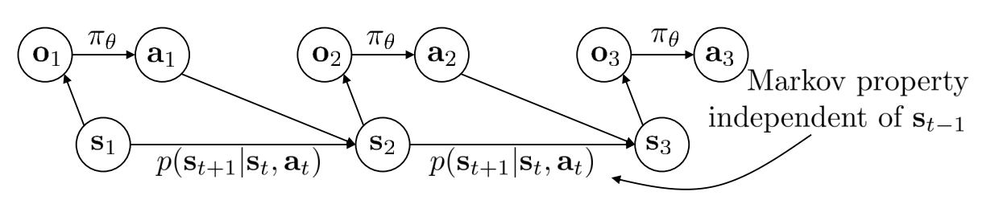
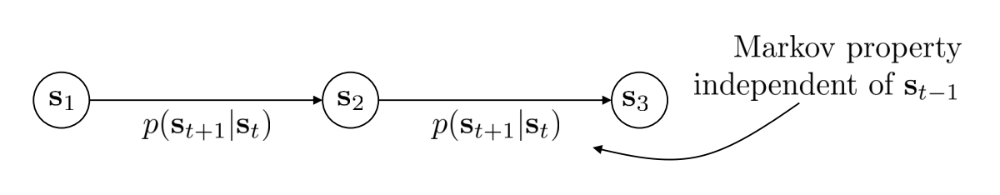
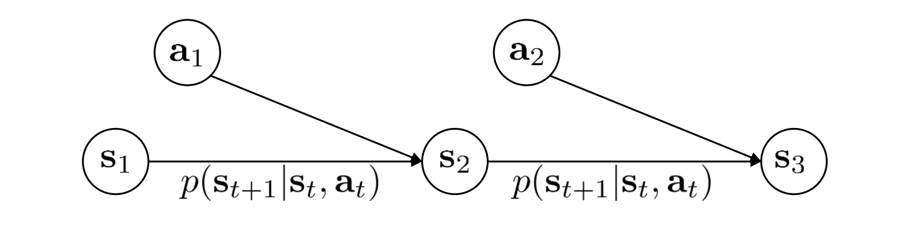

$$
\gdef\at{\textbf{a}_t}
\gdef\st{\textbf{s}_t}
\gdef\ot{\textbf{o}_t}
\gdef\pt{\pi_\theta}
\gdef\M{\mathcal{M}}
\gdef\S{\mathcal{S}}
\gdef\T{\mathcal{T}}
\gdef\a{\textbf{a}}
\gdef\s{\textbf{s}}
$$

# Lecture 4: Introduction to RL

This lecture first introduces us to reinforcement learning (RL) and its basic terms and variants.

## Basic Terms

The basic variables are similar to that of imitation learning.

- $\at$ - action at time $t$
- $\st$ - state at time $t$
- $\ot$ - observation at time $t$
- $\pt(\at\mid\st)$ - policy (given states / fully observed)
- $\pt(\at\mid\ot)$ - policy (given observations)

## Imitation Learning vs RL

Imitation learning attempts to mimic expert actions through standard supervised training techniques. What RL does is, instead of mimicking expert actions, it finds its own methods of achieving goals through exploring its environment. It knows whether it has made a good action or not through cumulative reward through a path. The higher the reward, the better the path. The goal of RL algorithms is to enable the agent to learn the optimal policy for any given goal and environment through a mix of exploration and exploitation.

## Definitions

### Markov Chain

$\M = \{\S, \T\}$

- $\S$ - state space
- $\T$ = transition operator

$\T$ is the transition _operator_ since $\overrightarrow{\mu}_{t+1} = \T\overrightarrow{\mu}_t$, where $\T_{i, j} = p(s_{t+1} = i \mid s_t = j)$ and $\overrightarrow{\mu}_{t, i} = p(\st = i)$

### Markov Decision Process

A markov decision process defers from a markov chain in that $\textbf{s}_{t+1}$ is dependent on both $\st$ and $\at$ through the transition operator $\T$.

The equation for $\T$ becomes $\T_{i, j, k} = p(s_{t+1}=i \mid s_t = j, a_t = k)$ and $\mu_{t+1, i} = \sum_{j, k} \T_{i, j, k}\mu_{t,j}\xi_{t, k}$ where

- $\mu_{t,j} = p(s_t = j)$
- $\xi_{t, k} = p(a_t = k)$
- $\T_{i, j, k} = p(s_{t+1} = i \mid s_t = j, a_t = k)$

### Partially Observed Markov Decision Process (POMDP)

The POMDP is the same as the MDP but there is an emission probability $\epsilon = p(o_t \mid s_t)$ that defines the probability an observation is $o_t$ given state $s_t$.

## Goal of reinforcement learning

The goal of reinforcement learning is to find the policy $\pt(\bold{a} \mid \bold{s})$ that maximizes expected return over the policy's distribution. In other words,
$$\theta^* = \arg \max_\theta E_{\T \sim p_\theta(\T)}[\sum_t r(\bold{s}_t, \bold{a}_t)]$$

The action taken from timestep $t$ is a function of the current state and timestep. Because of the assumption that states assume the markov property, actions only need to be conditioned on only the current state rather than past states. (It is important to note that observations $\bold{o}$ do not necessarily follow the markov property).

### Finite horizon case: state-action marginal

By linearity of expectation, we can redefine $\theta^*$ as
$$\theta^* = \arg \max_\theta \sum^T_{t=1}E_{(\st, \at) \sim p_\theta(\st, \at)}[r(\st, \at)]$$
where $p_\theta(\st, \at)$ is the state-action marginal.

### Infinite horizon case: stationary distribution

In the infinite horizon case (w/o discounts), we want to check if a stationary distribution exists (a stationary distribution exists if the MDP is aperiodic and ergodic [there is a non-zero probability that all states will be visited]). This is because the MDP is expected to converge to the stationary distribution as $t \rightarrow \infty$.

The stationary distribution is defined by $\mu = \T\mu$. This can be rearranged to $(\T - \bold{I})\mu = 0$, so $\mu$ is the eigenvector of $\T$ with eigenvalue 1.

### In RL, we care about expectations.

Reward functions are not usually smooth, so it can't be differentiated. However, if we take the expectation of the reward function over some policy $\pt$, this function is smooth in $\theta$, so we can differentiate it over $\theta$.

## Anatomy of RL algorithm

RL algorithms follow the loop of **generate samples**, **fit a model/estimate return**, and **improve the policy**.

### RL by backprop

For backpropogation algorithms, we can fit a model to estimate $f_\phi$ such that $\bold{s}_{t+1} \approx f_\phi (\st, \at)$. Using this, we can backprop through $f_\phi$ and $r$ to train the policy.

The way we estimate the return after fitting a model is by averaging out the sampled values since it is a good cheap estimator of the policy's distribution.

### Value functions

Value functions provide a way with dealing with expectation. The value function $V^\pi(\st)$ is defined as the expectation of the total reward from $\st$.

Q-functions $Q^\pi(\st, \at)$ provide another way of dealing with expectation, but rather than it being the expectation of total reward from $\st$, it is the expectation of total reward from $\st$ when taking action $\at$.

Using this definition, it is easy to see that the value function of state $\st$ is equal to the expectation over action given state marginal of the policy. In other words,

$$V^\pi(\st) = E_{\at \sim \pi(\at \mid \st)}[Q^\pi(\st, \at)]$$

Using the value function, the RL objective can be written as
$$E_{\bold{s}_1 \sim p(\bold{s}_1)}[V^\pi(\bold{s}_1)]$$

## Types of RL Algorithms

The RL objective can be defined as $E_{\tau\sim p_\theta(\tau)}[\sum_t r(\st, \at)]$. We find the weights of the optimal policy $\theta^*$ can be found by taking the $\arg \max$ over $\theta$.

Mathematically, this comes out to solving the following problem:
$$\theta^* = \arg \max_{\theta} E_{\tau\sim p_\theta(\tau)}[\sum_t r(\st, \at)]$$

In order to find the weights that maximize this objective, we can use a few different algorithms

- Policy Gradients: directly differentiate the above objective
- Value-based: estimate value function or Q-function of the optimal policy
  - no explict policy
- Actor-critic: estimate value function or Q-function of the current policy, use it to improve policy
- Model-based RL: estimate te transition model, and then
  - use it for planning (no explicit policy)
  - use it to improve policy
  - or something else

### Policy Gradients

We evaluate the returns by taking the sum of the rewards $\sum_t r(\st, \at)$ over a given trajectory and then optimizing the policy by taking it's gradient over the weights and performing gradient ascent: $\theta \leftarrow \theta + \alpha \nabla_\theta E[\sum_t r(\st, \at)]$.

### Value functions

We find the optimal policy by continuously fitting $V(\s)$ or $Q(\s, \a)$ according to generated samples and improving the policy by setting $\pi(\s) = \arg \max_a Q(\s, \a)$. The policy has converged once the policy doesn't change after another iteration of the fit/improve loop.

### Actor-critic: policy gradients + value functions

We first fit $V(\s)$ or $Q(\s, \a)$ according to generated samples. This model is known as the critic. Then we improve the policy using gradient decent from the fitted model using the gradient ascent step $\theta \leftarrow \theta + \alpha \nabla_\theta E[Q(\st, \at)]$. The policy is known as the actor.

Actor-critic can be thought of as a variation of policy gradient, where instead of differentiating with respect to the rewards of the generated samples, we differentiate with respect to the fitted critic.

## Tradeoffs between algorithms

The reason for many different algorithms with one RL objective are the tradeoffs implicit to those algorithms. Some algorithms prioritize sample efficiency over stability and ease of use. There are also different assumptions used given an algorithm. For example, when the problem is stochastic or deterministic, continuous or discrete, or episodic or infinite in nature.

Additionally, some things are easy or hard to represent in different settings. Sometimes, it's easier to represent the policy and sometimes it's easier to represent the model. These differences in problem definition greatly influences which algorithm is best for a specific task.'

### Comparison: sample efficiency

Sample efficiency measures how many samples we need to get a good policy. The most important question when considering sample efficiency is **is the algorithm off policy?**

- **Off-policy** describes algorithms that do not need to regenerate samples from an improved policy to improve the current policy further. This means we don't always have to sample new data points with our iteratively improved policy and instead we can use previous data points to improve our policy further.
- **On-policy** is the opposite of this. It requires us to regenerate samples every time we incrementally improve our current policy.

The most efficient models are off-policy. In order from better to worse sample efficiency, some examples are

- model-based shallow RL
- model based deep RL
- off-policy Q-function learning
- actor-critic style methods\*
  - _actor-critic methods can be both off- or on-policy_

Some more on-policy models in order from better to worse sample efficiency are

- on-policy policy gradient algorithms
- evolutionary or gradient-free algorithms (ex. value iteration)

### Comparison: stability and ease of use

When determining methods to use, we must ask if our method converges and if so, to what? And, does it converge every time?

The reason we ask this is because in RL, there are many different algorithms we use depending on the problem. Unlike, supervised learning, where we almost always use gradient descent, there are a host of choices we could use due to convergence guarantees and optimization assumptions.

#### Value function fitting

At best, minimizes error of fit ('bellman error'), since we don't explicitly find a policy and instead take action that produces the maximum value from any given state to implicitly define the function.

This isn't the same as maximizing expected reward. It only attempts to fit rewards accurately given a state (or state-action) pair.

At worst, it doesn't optimize anything as there is no guarantee of convergence for most popular deep RL value fitting algorithms in the non-linear case.

#### Model-based RL

Model minimizes error of fit, which converges using typical supervised learning, but there is no guarantee that a better model = better policy.

#### Policy gradient

This is the only method that performs gradient ascent on the true RL objective (expected reward over the trajectory distribution of the policy).

### Comparison: assumptions

#### Common assumption #1: full observability

Full observability (no partial observability) is often assumed by value function fitting methods, but this can be mitigated by adding recurrence. This can also be thought of as assuming the markov property.

#### Common assumption #2: episodic learning

Episodic reinforcement learning assumes a finite-horizon. This is often assumed by pure policy gradient methods and assumed by some model-based RL methods.

#### Common assumption #3: continuity or smoothness.

This is assumed by some continuous value function learning methods, and is often assumed by some model-based RL methods.

## Algorithm Examples

Here are a few specific examples of each type of algorithm

- Value function fitting methods
  - Q-learning, DQN
  - Temporal difference learning
  - Fitted value iteration
- Policy gradient methods
  - REINFORCE
  - Natural policy gradient
  - Trust region policy optimization (TRPO)
- Actor-critic algorithms
  - Asynchronous advantage actor-critic (A3C)
  - Soft actor-critic (SAC)
- Model-based RL algorithms
  - Dyna
  - Guided policy search
