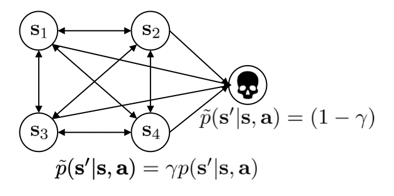
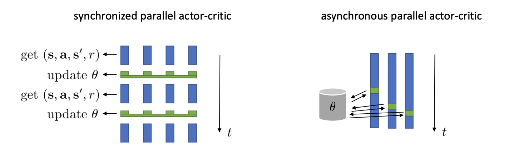

<!--
\newcommand{\at}{\textbf{a}_t}
\newcommand{\st}{\textbf{s}_t}
\newcommand{\ot}{\textbf{o}_t}
\newcommand{\pt}{{\pi_\theta}}
\newcommand{\M}{\mathcal{M}}
\renewcommand{\S}{\mathcal{S}}
\newcommand{\T}{\mathcal{T}}
\renewcommand{\a}{\textbf{a}}
\newcommand{\s}{\textbf{s}}
\newcommand{\ptot}{{\tau\sim p_\theta(\tau)}}
\newcommand{\jt}{J(\theta)}
\newcommand{\pg}{\nabla*\theta \jt}
\newcommand{\djt}{\pg}
\newcommand{\prtt}{p*\theta(\tau)}
\newcommand{\rt}{r(\tau)}
\newcommand{\nt}{\nabla*\theta}
\newcommand{\Vp}{V^\pi}
\newcommand{\Qp}{Q^\pi}
\newcommand{\Ap}{A^\pi}
\newcommand{\Vps}{V^\pi(\st)}
\newcommand{\Qps}{Q^\pi(\st, \at)}
\newcommand{\Aps}{A^\pi(\st, \at)}
\newcommand{\FVps}{\hat{V}*\phi^\pi(\st)}
\newcommand{\AVps}{\hat{A}_\phi^\pi(\st, \at)}
\newcommand{\QVps}{\hat{Q}_\phi^\pi(\st, \at)}
\newcommand{\R}{\mathcal{R}}
\newcommand{\AV}{\hat{A}_\phi^\pi}
\newcommand{\QV}{\hat{Q}_\phi^\pi}
\newcommand{\VV}{\hat{V}_\phi^\pi}
-->

$$
\def\at{\textbf{a}_t}
\def\st{\textbf{s}_t}
\def\ot{\textbf{o}_t}
\def\pt{{\pi_\theta}}
\def\M{\mathcal{M}}
\def\S{\mathcal{S}}
\def\T{\mathcal{T}}
\def\a{\textbf{a}}
\def\s{\textbf{s}}
\def\ptot{{\tau\sim p_\theta(\tau)}}
\def\jt{J(\theta)}
\def\pg{\nabla_\theta \jt}
\def\djt{\pg}
\def\prtt{p_\theta(\tau)}
\def\rt{r(\tau)}
\def\nt{\nabla_\theta}
\def\Vp{V^\pi}
\def\Qp{Q^\pi}
\def\Ap{A^\pi}
\def\Vps{V^\pi(\st)}
\def\Qps{Q^\pi(\st, \at)}
\def\Aps{A^\pi(\st, \at)}
\def\FVps{\hat{V}_\phi^\pi(\st)}
\def\AVps{\hat{A}_\phi^\pi(\st, \at)}
\def\QVps{\hat{Q}_\phi^\pi(\st, \at)}
\def\R{\mathcal{R}}
\def\AV{\hat{A}_\phi^\pi}
\def\QV{\hat{Q}_\phi^\pi}
\def\VV{\hat{V}_\phi^\pi}
$$

Addison Kalanther (addikala@berkeley.edu)

# Lecture 6: Actor-Critic Algorithms

This lecture first introduces us to actor-critic algorithms.

## Improving the policy gradient

The policy gradient involved us estimating the gradients of a weighted log-likelihood, using reward-to-go as the weights. Rather than use the reward-to-go of a single trajectory, what if we used the expected value from the given state? Can we get a better estimate?

### Q-function

We calculate the expected reward when taking action $\at$ from state $\st$ using the following equation. This is known as the Q-function $Q(\st, \at)$.

$$Q^\pi(\st, \at) = \sum^T_{t'=t}E_\pt[r(\bold{s}_{t'}, \bold{a}_{t'}\mid\st,\at)]$$

### Value function

We can calculate the expected reward from state $\st$ by taking the expectation over the action distribution from that state. This is known as the value function $V(\st)$.

$$V^\pi(\st) = E_{\at\sim\pt(\at\mid\st)}[Q^\pi(\st, \at)]$$

### Advantage function

Advantage functions give us the expected advantage from taking action $\at$ from state $\st$.

$$\Ap(\st, \at) = \Qp(\st, \at) - \Vp(\st)$$

The better the advantage function estimate, the lower the variance in the policy gradient.

$$\djt\approx\frac1N\sum^N_{i=1}\sum^T_{t=1}\nt\log\pt(\at^i\mid\st^i)\underline{\Ap(\st^i, \at^i)}$$

## Value function fitting

We can rewrite the q-function $\Qp(\st, \at)$ and advantage $\Ap(\st, \at)$ using only the value function $\Vps$.

$$\Qps = r(\st, \at) + \Vps$$

$$\Aps = r(\st, \at) + V^\pi{\s_{t+1}} - \Vps$$

This shows us that we only need to fit a value function. We can fit a value function $\hat{V}^\pi(\s)$ using a deep neural net.

## Policy evaluation

We can get an estimate of the value function $\Vps$ for a given policy $\pi$ by taking a monte carlo estimate $\Vps \approx \sum^T_{t'=t}r(\s_{t'}, \a_{t'})$, which admittedly is not as good as an average over $N$ samples, but it is still decent.

Fit these to a neural net using supervised learning, taking the current state $\st$ as input and the reward-to-go as the output.

### Bootstrapped estimate

Rather than have our target $y$ be the reward-to-go, we can use the reward of the current state-action pair $r(\st, \at)$ and the previously fitted value function to get a lower variance approximation of the expected value function. Our ideal target becomes

$$\Vps \approx r(\st, \at) + \hat{V}_\phi^\pi(\s_{t+1})$$

This is sometimes referred to as the "bootstrapped" estimate.

### Examples

For a game of backgammon or chess, the fitted value function $\hat{V}_\phi^\pi(\st)$ could be the expected outcome given board state $\st$.

## From Evaluation to Actor-Critic

### Aside: discount factors for policy gradients

We have been mostly talking about processes with a finite horizon $T$, but what if we have an infinite-step process?

A simple trick is to force the robot to get rewards sooner than later by using a _discount factor_ $\gamma \in [0, 1]$. $\gamma = 0.99$ often works well.

This turns our old target estimated value $y_{i, t}$ to

$$y_{i, t} \approx r(\s_{i, t}, \a_{i, t}) + \gamma\hat{V}_\phi^\pi(\s_{i, t+1})$$

This changes the MDP and can be interpreted as the robot having a $1-\gamma$ chance to end its run from any given state $\st$.

### Batch Actor-Critic Algorithm

The batch actor-critic algorithm is the most basic of the algorithms. It uses monte carlo evaluation to fit a value function $\FVps$ using a neural net. Then, using the fitted function to evaluate the advantage $\AVps$. We then use the advantage to perform our policy gradient step.

#### The algorithm

1. sample $\{\s_t, \a_t\}$ from $\pt(\at\mid\st)$ (run the agent)
2. fit $\FVps$ to sample reward sums
3. evaluate $\AVps = r(\s_t, \a_t) + \gamma\hat{V}_\phi^\pi(\s_{t+1}) - \FVps$ for all $\st, \at$ pairs
4. $\djt\approx\sum_t\nt\log\pt(\at\mid\st)\AVps$
5. $\theta \leftarrow \theta + \alpha\djt$
6. Repeat

### Online Actor-Critic Algorithm

Online actor-critic differs from batch actor-critic in that the policy is updated for every sampled action.

#### The algorithm

1. take action $\at\sim\pt(\at\mid\st)$, get $(\st, \at, \s_{t+1}, r)$
2. update $\FVps$ using target $r + \gamma\hat{V}_\phi^\pi(\s_{t+1})$
3. evaluate $\AVps = r(\s_t, \a_t) + \gamma\hat{V}_\phi^\pi(\s_{t+1}) - \FVps$
4. $\djt\approx\sum_t\nt\log\pt(\at\mid\st)\AVps$
5. $\theta \leftarrow \theta + \alpha\djt$
6. Repeat

## Actor-critic design decisions

### Architecture

In an actor-critic algorithm, we have two networks: one for the value function $\FVps$ and one for the policy $\pt(\at\mid\st)$. We can either use two separate networks or a shared network with two different heads.

With two separate networks, it would be easier to train and be more stable (due to no opposing gradients), but there would be no shared features between actor & critic (no sharing of information).

### Online actor-critic in practice

Online actor-critic often does not do a policy gradient step per samples. Instead, it takes advantage of batching using parallel workers.

Synchronized parallel workers have $n$ threads going one step at a time and then updates $\theta$ once all threads complete their run.

Asynchronous parallel workers don't wait for each other and update once it gets an sample from a thread. While this does mean that the gradients for some threads won't be for the current policy due to race conditions, if the sampling is fast enough, it should not introduce too much bias and still works.

## Off-policy assumption

Basic actor-critic algorithms are on-policy. However, what if we can use old, previously seen transitions not from the current policy. If we can, we recover an off-policy algorithm.

We can store transitions $(\st, \at, \s_{t+1}, r)$ from all past policies in a _replay buffer_ $\mathcal{R}$.

Since the value function $\FVps$ is no longer specific to a policy, we want to fit a Q-function $\QVps$ instead.

#### Online off-policy actor-critic algorithm

1. take action $\a\sim\pt(\a\mid\s)$, get $(\s. \a, \s', r)$, store in $\R$
2. sample a batch $\{\st, \at, \s_{t+1}, r_t\}$ from buffer $\R$
3. update $\QV$ using targets $y_i = r_i + \gamma\QV(\s_{t+1}, \a_{t+1})$
   - Note that $\a_{t+1} \sim \pt(\a_{t+1}\mid\s_{t+1})$ is sampled from the current policy, **not** from the replay buffer $\R$
4. $\djt \approx \frac1N\sum_t\nt\log\pt(\at^\pi\mid\st)\QV(\st,\at^\pi)$ where $\at^\pi \sim \pt(\a\mid\st)$
5. $\theta \leftarrow \theta + \alpha\djt$
6. Repeat

A problem with this algorithm is that $\st$ from buffer $\R$ does not come from the $\pt$ distribution. There is nothing we can do about this, but this is okay, as we want the optimal policy on $p_\theta(\s)$, but we instead get an optimal policy on a _broader_ distribution.

#### Aside: Reparameterization trick

We can also use the _reparameterization trick_ in step 4 to better estimate the integral of our log probabilities.

A fundamental issue with our Monte Carlo integration is that our $\pg$ estimate is often _very high variance_. Even when we take the average over a large number of samples, we might miss some rare states that greatly affect our expectation.

By rewriting the expectation as a function of the random variable $p$, we can chose it's distribution and control the estimate such that the chances of drawing formerly rare states are more common in the $p$ distribution.

Using this, we can rewrite the expectation of some arbitrary $G_\theta$ as the following

$$G_\theta = \nt E_{\epsilon\sim p}[J(\theta, \epsilon)] = E_{\epsilon\sim p}[\nt J(\theta, \epsilon)]$$

The reparameterization trick can alleviate the high variance issue, and even if $\nt J(\theta, \epsilon)$ is not a good estimator of $G_\theta$, if large contributions from $\epsilon$ are very rare, we don't see it often enough in optimization for it to matter all too much (it would essentially become noise).

We often see the reparameterization trick in the context of VAE's, where we need to sample from a large space, and we control that sampling and the probabilities of states by choosing our $p$ distribution.

In reinforcement learning, we can control our Monte Carlo integration so we get more or less rare / desired state-action samples by choosing our $p$ distribution, rather than having it depend on $\theta$.

## Critics as baselines

Actor-critics use a learned critic as a baseline ($r(\st, \at) + \gamma\VV(\s_{t+1}) - \FVps$) during the policy gradient update. This results in a lower variance (due to the critic), but it would not be unbiased if the critic is not perfect.

- This is because the next state used in $\VV(\s_{t+1})$ is dependant on the current policy's action, which is dependent on $\theta$.

Base policy gradients which use some constant as a baseline ($\left(\sum^T_{t'=t}\gamma^{t' - t}r(\st, \at)\right) - b$) has no bias, but has a higher variance due to its single-sample estimate.

We can use the critic without the bias by using the critic as the baseline $\left(\sum^T_{t'=t}\gamma^{t' - t}r(\st, \at)\right) - \FVps$. This has the advantage of being unbiased while having a lower variance (baseline is closer to rewards).

### Control variates: action-dependent baselines

Action-dependent baselines can be used to lower variance at the cost of introducing some bias.

Take $\hat{A}^\pi(\st, \at) = \sum^\infty_{t'=t}\gamma^{t'-t}r(\s_{t'}, \a_{t'}) - \QVps$, this goes to zero in expectation if critic is correct. However, critic is never 100% correct, so it is never correct.

Let's go back to our critic advantage function $\hat{A}_{\text{C}}^\pi(\st, \at) = r(\st, \at) + \gamma\VV(\s_{t+1}) - \FVps$, this has the advantage of being lower variance, but higher bias if wrong (which it always is).

Our single estimate Monte Carlo advantage $\hat{A}_{\text{MC}}^\pi(\st, \at) = \left(\sum^T_{t'=t}\gamma^{t' - t}r(\st, \at)\right) - \FVps$ has no bias, but has a higher variance.

Can we combine these two to control the bias/variance tradeoff?

## Generalized advantage estimation (GAE)

Let's first look at an n-step critic advantage function

$$\hat{A}_n^\pi(\st, \at) = \sum^{t+n}_{t'=t}\gamma^{t'-t}r(\s_{t'}, \a_{t'}) +  \gamma^n\VV(\s_{t+n}) - \FVps$$

By controlling $n$, we control how much of the single sample Monte Carlo estimate we want to use to estimate the advantage function. With higher $n$, we introduce less bias and more variance. With lower $n$, we introduce more variance and less bias.

However, what if we don't have to choose just one $n$? Instead, let's choose to cutoff our paths everywhere all at once!

This is what the **Generalized Advantage Estimation (GAE)** entails. It is a weighted combination of n-step returns of the form

$$\hat{A}_{\text{GAE}}^\pi(\st, \at) = \sum_{n=1}^\infty w_n \hat{A}_n^\pi(\st, \at)$$

We prefer cutting earlier for less variance, so we would like our weights to have an exponential falloff $w_n \propto \lambda^{n-1}$.

Using this, we can rewrite our GAE as

$$\hat{A}_{\text{GAE}}^\pi(\st, \at) = \sum_{t'=t}^\infty(\gamma\lambda)^{t'-t}\delta_{t'}$$

where $\delta_{t'}=r(\s_{t'}, \a_{t'}) + \gamma\VV(\s_{t'+1}) - \VV(\s_{t'})$.

The $\gamma\lambda$ term looks like our discount factor $\gamma$ in typical reward-to-go. From this, we can conclude that discount is a form of variance reduction as well.

## Actor-critic suggested readings

### Classic papers

- [Sutton, McAllester, Singh, Mansour (1999). Policy gradient methods for reinforcement learning with function approximation](https://proceedings.neurips.cc/paper/1999/file/464d828b85b0bed98e80ade0a5c43b0f-Paper.pdf): actor-critic algorithms with value function approximation

### Deep reinforcement learning actor-critic papers

- [Mnih, Badia, Mirza, Graves, Lillicrap, Harley, Silver, Kavukcuoglu (2016). Asynchronous methods for deep reinforcement learning](https://arxiv.org/abs/1602.01783): A3C -- parallel online actor-critic

- [Schulman, Moritz, L., Jordan, Abbeel (2016). High-dimensional continuous control using generalized advantage estimation](https://arxiv.org/abs/1506.02438): batch-mode actor-critic with blended Monte Carlo and function approximator returns

- [Gu, Lillicrap, Ghahramani, Turner, L. (2017). Q-Prop: sample-efficient policy- gradient with an off-policy critic](https://arxiv.org/abs/1611.02247): policy gradient with Q-function control variate
