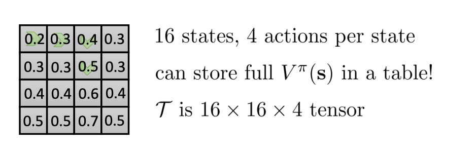
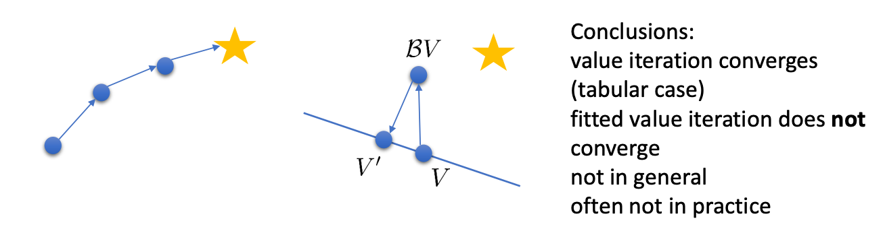

<!--
\newcommand{\s}{\textbf{s}}
\renewcommand{\a}{\textbf{a}}
\newcommand{\st}{{\s_t}}
\newcommand{\si}{{\s_i}}
\newcommand{\ai}{{\a_i}}
\newcommand{\stt}[1]{{\s_{t + #1}}}
\newcommand{\at}{{\a_t}}
\newcommand{\att}[1]{{\a_{t+#1}}}
\newcommand{\Ap}{A^\pi(\st, \at)}
\newcommand{\Qp}{Q^\pi(\st, \at)}
\newcommand{\Qpb}{Q^\pi(\s, \a)}
\newcommand{\Apt}[1]{A^\pi(\s_{t+#1}, \a_{t+#1})}
\newcommand{\Vp}{V^\pi(\st)}
\newcommand{\Vpb}{V^\pi(\s)}
\newcommand{\Vpt}[1]{V^\pi(\stt{#1})}
\newcommand{\pol}{\pi(\at \mid \st)}
\newcommand{\polb}{\pi(\a \mid \s)}
\newcommand{\Qphi}{Q_\phi(\s, \a)}
\newcommand{\Qphia}{Q_\phi(\s', \a')}
-->

$$
\newcommand{\s}{\textbf{s}}
\newcommand{\a}{\textbf{a}}
\newcommand{\st}{{\s_t}}
\newcommand{\si}{{\s_i}}
\newcommand{\ai}{{\a_i}}
\newcommand{\stt}[1]{{\s_{t + #1}}}
\newcommand{\at}{{\a_t}}
\newcommand{\att}[1]{{\a_{t+#1}}}
\newcommand{\Ap}{A^\pi(\st, \at)}
\newcommand{\Qp}{Q^\pi(\st, \at)}
\newcommand{\Qpb}{Q^\pi(\s, \a)}
\newcommand{\Apt}[1]{A^\pi(\s_{t+#1}, \a_{t+#1})}
\newcommand{\Vp}{V^\pi(\st)}
\newcommand{\Vpb}{V^\pi(\s)}
\newcommand{\Vpt}[1]{V^\pi(\stt{#1})}
\newcommand{\pol}{\pi(\at \mid \st)}
\newcommand{\polb}{\pi(\a \mid \s)}
\newcommand{\Qphi}{Q_\phi(\s, \a)}
\newcommand{\Qphia}{Q_\phi(\s', \a')}
$$

Addison Kalanther (addikala@berkeley.edu)

# Lecture 7: Value Function Methods

In the last lecture, we went over actor-critic algorithms, which used value functions to define our advantage function for the policy gradient step. In this lecture, we explore how we can omit the policy gradient completely to recover pure value function based methods.

## Omitting the policy gradient

The advantage $\Ap$ tells us how much better $\at$ is than the average action according to $\pi$.

What if we implicitly define the policy using $\arg \max_\at\Ap$. This would be the best action from $\st$ if we follow $\pi$. This guarantees that our action is at _least_ as good as any action $\at\sim\pol$, regardless of $\pi$.

More rigorously, we can define our policy as the following.

$$
\pi'(\at \mid \st) =
\begin{cases}
    1 & \text{if } \at = \arg \max_\at\Ap \\
    0 & \text{otherwise}
\end{cases}
$$

This is guaranteed to be as good as $\pi$ and will likely be better.

## Policy Iteration

The idea behind policy iteration is to repeat the above policy redefinition until convergence. This happens when the policy iteration update (step 2) no longer changes the policy.

#### Policy Iteration Algorithm

1. evaluate $\Ap$
2. set $\pi \leftarrow \pi'$
3. Repeat

As before, $\Ap = r(\st, \at) + \gamma E[\Vpt1] - \Vp$

### Evaluating $\Vpb$

#### Dynamic Programming

Let's assume we know the transition dynamics $p(\s'\mid\s,\a)$ and that $\s$ and $\a$ are both discrete (and small).

We can store all $\Vpb$ in a table, updating $\Vpb$ per step through the transition tensor $\mathcal{T}$ using the following bootstrapped update.

$$\Vpb \leftarrow E_{\a\sim\polb}[r(\s, \a) + \gamma E_{\s'\sim o(\s'\mid\s,\a)}[V^\pi(\s')]]$$

This can be simplified to

$$\Vpb \leftarrow r(\s, \pi(\s)) + \gamma E_{\s'\sim p(\s'\mid\s,\a)}[V^\pi(\s')]$$

Repeating this until convergence, this gives us our **policy evaluation** algorithm.

#### Policy evaluation algorithm

1. $\Vpb \leftarrow r(\s, \pi(\s)) + \gamma E_{\s'\sim p(\s'\mid\s,\a)}[V^\pi(\s')]$
2. Repeat

## Value Iteration

An even simpler method can be computed if we don't explicitly compute our policy. Instead, if we implicitly define our policy through finding the $\arg\max_\a Q(\s, \a)$ once $Q$ converges. This is because

$$\arg\max_\at \Ap = \arg\max_\at \Qp$$

This means we can evaluate

$$\Qpb = r(\s, \a) + \gamma E[V^\pi(\s')]$$

which is a bit simpler.

#### Value iteration algorithm

1. set $\Qpb \leftarrow r(\s, \a) + \gamma E[V(\s')]$
2. set $V(\s) \leftarrow \max_\a Q(\s, \a)$
3. repeat

We recover our policy by $\arg\max_\a\Qpb\rightarrow \text{policy}$.

## Fitted Value Iteration

For most problems, we can't have a full table for each $\Qpb$ and $\Vpb$ entry (due to curse of dimensionality). When this is the case, we need a way to model our Q- and value functions.

Rather than have a tabular representation of the value functions $V(\s)$, what if we used a neural net function $V : \mathcal{S} \rightarrow \mathbb{R}$ with parameters $\phi$?

We would get **fitted value iteration**, which fits a neural net to approximate the value function and then performs value iteration using the previous steps fitted value function.

#### Fitted value iteration algorithm

1. set $\bold{y}_i \leftarrow \max_{\a_i}(r(\s_i, \a_i) + \gamma E[V_\phi(\s_i')])$
2. set $\phi \leftarrow \arg\min_\phi \frac12\sum_i||V_\phi(\s_i)-\bold{y}_i||^2$
3. Repeat

Step 1 is the evaluation step, and step 2 is the update step. We go until convergence or desired performance has been reached, since convergence is only guaranteed in the tabular case.

The problem with fitted value iteration is that we still need to know the transition dynamics to evaluate step 1 (to find $\max_{a_i}$ and $E[V_\phi(\s_i')]$). We can forgo the transition dynamics if we use Q-values instead.

## Fitted Q-iteration

With fitted q-iteration. We don't need to know the transition dynamics. It can instead be inferred from the collected samples.

#### Basic fitted Q-iteration algorithm

1. set $\bold{y}_i \leftarrow r(\s_i, \a_i) + \gamma E[V_\phi(\s_i')]$
   - approximate $E[V(\s_i')] \approx \max_{\a'}Q_\phi(\s_i', \a_i')$
2. set $\phi \leftarrow \arg\min_\phi \frac12 \sum_i ||Q_\phi(\s_i, \a_i) - y_i||^2$
3. Repeat

A few advantages of q-iteration is that it works for off-policy samples, unlike actor-critic, and only requires one network without a high-variance policy gradient. The issue is that there are no convergence guarantees for non-linear function approximations like this one.

### Full fitted Q-iteration algorithm

The fully fitted q-iteration algorithm collects a dataset using some policy and then runs q-iteration $K$ times before collecting more samples from the environment. This allows for the Q-value approximator $Q_\phi(\s, \a)$ to sufficiently update it's parameters before using new samples.

#### Full fitted Q-iteration algorithm (step-by-step)

1. collect dataset $\{(\s_i, \a_i, \s_i', r_i)\}$ using some policy
2. Run the following procedure $K$ times
   1. set $\bold{y}_i \leftarrow r(\s_i, \a_i) + \gamma \max_{\a_i'}Q_\phi(\s_i', \a_i')$
   2. set $\phi \leftarrow \arg\min_\phi \frac12 \sum_i ||Q_\phi(\s_i, \a_i) - y_i||^2$
3. Repeat

## From Q-iteration to Q-Learning

### What makes Q-iteration off-policy?

The dataset in step 1 of the full fitted Q-iteration algorithm doesn't specify we need to use the current policy to collect samples. This means we can keep a dataset of transitions in a replay buffer $R$. Following this, in step 1 of the s sub-procedure, the $\s_i, \a_i$ transition is independent of $\pi$, and the $\max_{\a_i'}$ can be computed using the current policy without having to sample from the environment.

### What is fitted Q-iteration optimizing?

Q-iteration is optimizing the _bellman error_. It is defined as the following

$$\epsilon = \frac12 E_{(\s, \a)\sim\beta}\left[\left(Q_\phi(\s, \a) - [r(\s, \a) + \gamma \max_{a'}Q_\phi(\s', \a')]\right)^2\right]$$

If $\epsilon = 0$, then $\Qphi = r(\s, \a) + \gamma \max_{a'}\Qphia$, the neural net has converged to the optimal Q-function, corresponding to the optimal policy $\pi'$.

The optimal policy is sometimes written using $Q^*$ and $\pi^*$.

### Online Q-iteration

Online q-iteration is like our full fitted q-iteration algorithm, but the dataset is of size $N=1$ and continuously sampled from our environment, and our subprocess does not repeat ($K=1$).

#### Online Q-iteration algorithm

1. take some action $\a_i$ and observe $(\s_i, \a_i, \s_i', r_i)$
2. $\bold{y}_i = r(\si, \ai) + \gamma\max_\ai \Qphia$
3. $\phi \leftarrow \phi - \alpha \frac{dQ_\phi}{d\phi}(\Qphia - \bold{y}_i)$

The final policy would follow from taking the $\arg \max_\at\Qp$. However, this wouldn't be the optimal policy for taking some action in step 1. This is because the policy would not explore actions other than what is immediately giving the best outcome (it would never realize rewards from lucrative long-horizon trajectories). Because of this, we have to use a policy that is prone to _exploration_, which describes how much it deviates from the current best policy to explore other less immediately-optimal actions.

Two common policies that incorporate exploration are **epsilon-greedy**:

$$
\pi(\at\mid\st) =
\begin{cases}
1 - \epsilon & if \at = \arg\max_\at\Qp \\
\epsilon / (|\mathcal{A}| - 1) & \text{otherwise}
\end{cases}
$$

_($|\mathcal{A}|$ is the cardinality of the action space)_

and **Boltzman exploration**:

$$\pi(\at\mid\st) \propto \exp(Q_\phi(\st, \at))$$

Some might recognize this as being a form of _softmax_, which is why this is also called _softmax exploration_.

### Q-iteration vs Q-learning

The difference between standard fitted q-iteration and q-learning is that q-iteration takes from any $\st, \at$ transition pair while Q-learning is online and samples its transitions from some form of its current policy. Online fitted q-iteration is a form of q-learning.

It is important to note that q-learning specifically makes use of a neural network to learn it's q-values. Standard q-iteration does not have this restriction (for example, could be tabular as discussed before).

## Value function learning theory

### Does it converge?

A question with these methods is whether or not it converges. We discussed previously that tabular q-iteration converges, but why?

Let's define an operator $\mathcal{B}: \mathcal{B}V = \max_\a r_\a + \gamma \mathcal{T}_\a V$, $\mathcal{T}$ is a matrix of transitions for action $\a$ such that $\mathcal{T}_{\a, i, j} = p(\s' = i \mid \s = j, \a)$.

$V^*$ is a _fixed point_ of $\mathcal{B}$. We know that $V^*(\s) = \max_\a r(\s, \a) + \gamma E[V^*(\s')]$, so $V^* = \mathcal{B}V^*$, since value iteration converges to a policy that does not change given max action or expectation. This results in the equality above as this is only true if the chosen action gives the maximum expected reward for every state.

This point always exists and is always unique, but it is not always guaranteed we will reach it.

### Value iteration (tabular)

We can prove that value iteration reaches $V^*$ because $\mathcal{B}$ is a _contraction_.

#### Contraction

A function $f$ is a contraction if it satisfies the following,

$$d(f(x), f(y)) \leq kd(x, y)$$

where $d$ is some distance measure.

In this case, for any $V$ and $\bar{V}$, we have $||\mathcal{B}V - \mathcal{B}\bar{V}||_\infty \leq \gamma ||V - \bar{V}||_\infty$.

From this, we see that for every value iteration update, the gap always gets smaller by $\gamma$. We can choose $\hat{V}$ to be $V^*$, which leaves us with $||\mathcal{B}V - V^*||_\infty \leq \gamma||V - V^*||_\infty$.

This means for every value iteration step, we get closer to the optimal value function, since the value iteration algorithm can be reformulated as applying the operator $\mathcal{B}$ until conversion.

#### Value iteration algorithm (using $\mathcal{B}$)

1. $V \leftarrow \mathcal{B}V$
2. Repeat

### Fitted value iteration

Let's define a new operator $\Pi$ as $\Pi V = \arg\min_{V\in\Omega}\frac12\sum||V'(\s) - V(\s)||^2$. We see that $\Pi$ is a _projection_ onto $\Omega$ (in terms of $l_2$ norm).

Using $\Pi$ and $\mathcal{B}$, we can rewrite the fitted value iteration update step as

$$V' \leftarrow \arg\min_{V'\in\Omega}\frac12\sum||V'(\s) - (\mathcal{B}V)(\s)||^2 = \Pi\mathcal{B}V$$

We can now rewrite our algorithm using these operators.

#### Fitted value iteration algorithm (using $\Pi$ and $\mathcal{B}$)

1. $V \leftarrow \Pi\mathcal{B}V$

We can visualize the contraction by $\mathcal{B}$ then the projection onto $\Omega$. The contraction will try to take the point closer to the optimum, but the projection will take the point and put it back on the line corresponding to the set $\Omega$ (e.g. representing neural nets).

This causes the point to continuously 'rubber-band' between moving closer to the point and being projected back to the $\Omega$ set. Over iterations, this can actually cause the point moving away from the optimum, _leaving us with no convergence guarantee_.

This is despite the fact that $\mathcal{B}$ is a contraction w.r.t. $\infty$-norm ("max" norm) as $||\mathcal{B}V - \mathcal{B}\bar{V}||_\infty \leq \gamma ||V - \bar{V}||_\infty$ and $\Pi$ is a contraction w.r.t. $l_2$-norm (Euclidean distance) as $||\Pi V - \Pi \bar{V}||^2 \leq \gamma ||V - \bar{V}||^2$. The composite operator $\Pi\mathcal{B}$ is not a contraction of any kind.

### Fitted Q-iteration

Fitted Q-iteration has the same problem as fitted value iteration. The update step can be rewritten as $Q \leftarrow \Pi\mathcal{B}Q$, which means that it is prone to the same contraction/projection problem.

### Online Q-iteration

This also applies to online q-iteration, despite the fact that the update step is different ($\phi \leftarrow \phi - \alpha\frac{dQ_\phi}{d\phi}(\si, \ai)(Q_\phi(\si, \ai) - \textbf{y}_i)$).

One might think that the update step is just gradient descent, so it has to converge. However, it is not gradient descent, as there is no gradient through the target value $\textbf{y}_i = r(\si, \ai) + \gamma \max_{\a'}Q_\phi(\si', \ai')$.

#### A sad corollary

There is a similar update step in the batch-actor critic algorithm to update the value function to use as the critic. However, there is the same issue of there being an $l_\infty$ contraction when evaluating $\textbf{y}_i$ for datapoints in a fitted bootstrapped policy iteration and the $l_2$ contraction when using the mean squared error to fit the parameters of your fitted value function $V_\phi(\s)$.
