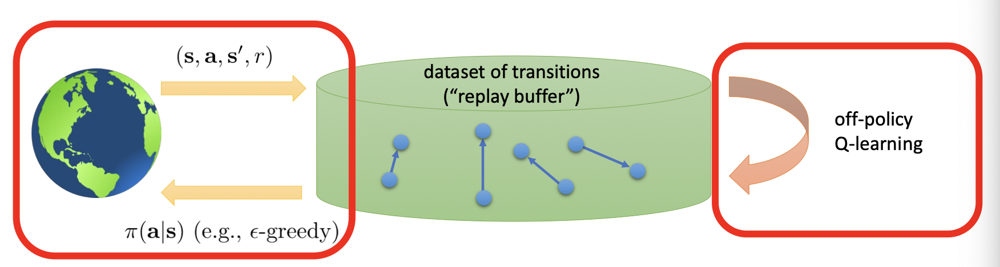
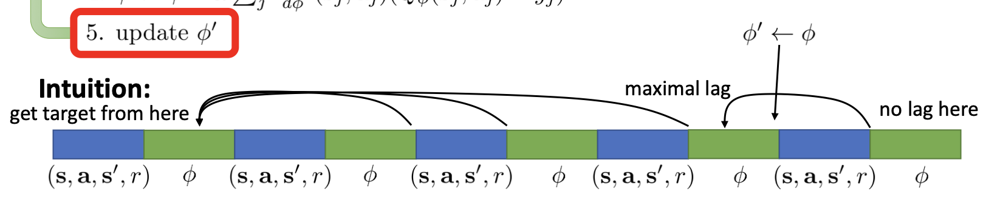
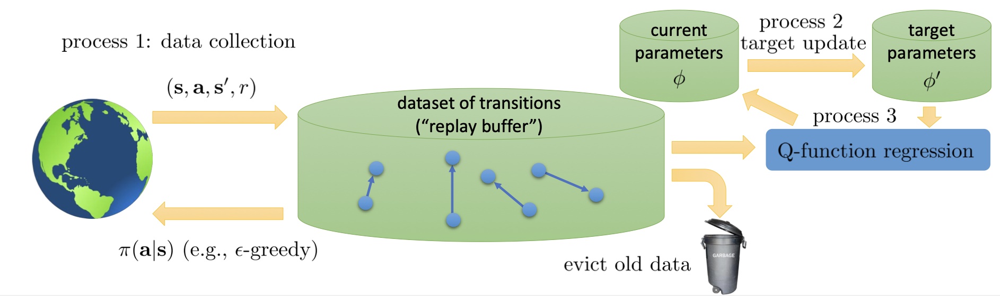

Addison Kalanther (addikala@berkeley.edu)

$$
\newcommand{\s}{\textbf{s}}
\newcommand{\a}{\textbf{a}}
\newcommand{\st}{{\s_t}}
\newcommand{\si}{{\s_i}}
\newcommand{\ai}{{\a_i}}
\newcommand{\stt}[1]{{\s_{t + #1}}}
\newcommand{\at}{{\a_t}}
\newcommand{\att}[1]{{\a_{t+#1}}}
\newcommand{\Qp}{Q_\phi}
\newcommand{\p}{\phi}
\newcommand{\y}{\bold{y}}
\newcommand{\B}{\mathcal{B}}
$$

# Lecture 8: Deep RL with Q-Functions

Last lecture, we covered the basics of q-learning. This lecture, we will dive into using q-values with deep learning.

## What's wrong with Q-learning?

Q-learning is _not_ gradient descent. Despite the update step looking very similar
$$\phi \leftarrow \phi - \alpha\frac{d\Qp}{d\p}(\si,\ai)(\Qp(\si, \ai)) - [r(\si, \ai) + \gamma\max_{\a'}\Qp(\si', \ai')]$$

There is no gradient through the target value ($r(\si, \ai) + \gamma\max_{\a'}\Qp(\si', \ai') = \y_i$), meaning it is not gradient descent (since the target value is not independent of the model). Subsequently, there is no convergence guarantee.

## Fixing Q-learning

### Correlated samples in online Q-learning

Sequential samples will be strongly correlated, and the target value is always changing. This means the network will face many different, opposing gradients, making it hard to train.

#### Parallel Q-learning

One solution is to use parallel q-learning. By using multiple samples, we reduce the variance of the gradients while training.

#### Replay buffers

Similar to parallel q-learning, replay buffers offer another way to increase the amount of samples used during the update step. This gives us another algorithm: **Q-learning with a replay buffer**.

#### 'Q-learning with a replay buffer' algorithm

1. sample a batch $(\si, \ai, \si', r_i)$ from $\B$ (replay buffer)
2. $\phi \leftarrow \phi - \alpha\sum_i\frac{d\Qp}{d\p}(\si, \ai) - [r(\si, \ai) + \gamma\max_{\a'}\Qp(\si', \ai')]$

By sampling batches from a replay buffer $\B$, samples are no longer correlated, and by using a sum of those samples from the batch, we ensure a low-variance gradient.

#### Filling the replay buffer $\B$

In the above algorithm, we use samples from a replay buffer $\B$ in the gradient update step. However, we need a way to fill the replay buffer with a diverse set of transitions for the Q-function to generalize to the entire sample space.

One way we can do this is to gather samples from a policy that is a variation of the current off-policy Q-learning function (e.g. $\epsilon$-greedy). While the replay buffer $\B$ is being filled, continuously sample and update the Q-learning policy via gradient descent.

### Moving target

Another problem with Q-learning is that it employs one gradient step, which has the problem of being a moving target. The network do not move sufficiently toward the target value before trying to fit to a different target.

This can be fixed using **Q-learning with target networks**, which uses two different networks during the update step. One network is updated while the other contributes to the target value by serving the previous Q-values (known as the **target** network). By not continuously updating the target values every iteration, we alleviate the moving target problem.

#### 'Q-learning with (replay buffer and) target networks' algorithm

1. save target network parameters: $\p' \leftarrow \p$
2. Repeat the following N times
   1. Collect dataset $\{(\si, \ai, \si', r_i)\}$ using some policy, add it to $\B$
   2. Repeat the following K times
      1. Sample a batch $(\si, \ai, \si', r_i)$ from $\B$
      2. $\p \leftarrow \p - \alpha \sum_i\frac{d\Qp}{d\p}(\si, \ai) - [r(\si, \ai) + \gamma \max_{\a'}Q_{\p'}(\si', \ai')]$
3. Repeat

### "Classic" deep Q-learning

Taking the last algorithm and setting $K = 1$ gives us the **classic deep Q-learning algorithm (DQN)**.

#### DQN Algorithm

1. take some action $\ai$ and observe $(\si, \ai, \si', r_i)$, add it to $\B$
2. sample mini-batch $\{\s_j, \a_j, \s_j', r_j \}$ from $\B$ uniformly
3. compute $y_j = r_j + \gamma\max_{\a'_j} Q_{\phi'}(\s_j', \a_j')$ using _target_ network $Q_{\phi'}$
4. $\phi \leftarrow \phi - \alpha\sum_j\frac{dQ_\phi}{d\phi}(\s_j, \a_j)(\Qp(\s_j, \a_j) - y_j)$
5. update $\phi'$: copy $\phi$ every $N$ steps

### Lagging target

An issue with the update step (step 5) is that there is no lag right after the target network $\p'$ update, but it is at maximal lag $N - 1$ steps after the last update.

We can fix this by employing some sort of 'moving average'. A popular choice is $\p' \leftarrow \tau\p' + (1-\tau)\phi$ with $\tau = 0.999$ found to work well.

## A more general view

A more general view of Q-learning splits algorithms into 3 processes.

- Process 1: Data Collection
- Process 2: Target Update
- Process 3: Q-function regression

### Popular variations

**Online Q-learning** evicts immediately, and processes 1, 2, and 3 all run at the same speed ($N = 1$).

**DQN** has processes 1 and 3 running at the same speed. Process 2 is slow.

**Fitted Q-iteration** has process 3 in the inner loop of process 2, which is in the inner loop of process 1.

## Improving Q-learning

In base DQN, it is found that value estimates greatly over estimates the true value, with the problem getting worse over training. This is because base DQN systematically overestimates the value function through it's target values and update steps.

### Overestimation in Q-learning

Imagine we have two random variables $X_1$ and $X_2$, we know that $E[\max(X_1, X_2)] \geq \max(E[X_1], E[X_2])$.

$Q_{\p'}(\s', \a')$ is not perfect, meaning it looks noisy. Because of this, $max_{\a'}Q_{\p'}(\s', \a')$ is prone to overestimating the next value.

Note that $\max_{\a'}Q_{\phi'}(\s', \a') = Q_{\phi'}(\s', \arg\max_{\a'}Q_{\p'}(\s', \a'))$. Through iterative update steps, we can see that the overestimate compounds, leading to much larger value estimates in the long run.

### Double Q-learning

We can break the compounding overestimation by decoupling the $\max$ step. By separating the network the value comes from from the action selected, we prevent this problem if the noise in the networks is decorrelated (overestimated values and overestimated actions can't continuously compound if this is the case).

Double Q-learning implements this by changing the formulation of the target value:

$$y = r + \gamma Q_{\phi'}(\s', \arg\max_{a'}Q_\phi(\s', \a'))$$

Notice that the value comes from network with parameters $\p'$ and the $\arg\max_{a'}$ comes from network with parameters $\p$. In other words, **the current network is now used to evaluate the action, while the target network is used to evaluate value.**

### Multi-step returns

In actor-critic, we used multiple steps to calculate the target value before relying on the learned value function. Can we do something similar for Q-learning?

#### Q-learning with N-step returns

We can formulate a target value similar to that used in actor-critic.

$$y_{j, t} = \sum_{t'=t}^{t+N - 1}\gamma^{t-t'}r_{j, t'} + \gamma^N\max_{\a_{j, t+N}}Q_{\phi'}(\s_{j, t+N}, \a_{j, t+N})$$

This has the advantage of _less biased target values with Q-values are inaccurate_ and _typically faster learning, especially early on_.

However, this method is only actually correct when learning on-policy. This is because we need transitions $\s_{j, t'}$, $\a_{j, t'}$, $\s_{j, t'+1}$ to come from $\pi$ for $t' - t < N - 1$.

A few ways we can fix this is to just ignore it (often works well), cut the trace by dynamically choosing $N$ to get only on-policy data (works well when data is mostly on-policy and the action space is small), and importance sampling.

## Q-learning with continuous actions

The problem with continuous action is trying to find the $\arg\max_\at$ during policy definition, and calculating $\max_{\a_j'}$ while deriving target values.

### Optimization

One way we can combat this is optimization, such as gradient based optimization (SGD), although this is a bit slow in the inner loop. However, the action space is typically low-dimensional, so we can take advantage of it through _stochastic optimization_.

#### Stochastic optimization

Stochastic optimization is an optimization method that relies on random algorithms to estimate an optimum point. Take the simplest solution:

$$\max_\a Q(\s, \a) \approx \max \{Q(\s, \a_1), ..., Q(\s, \a_N)\}$$

where $(\a_1, ..., \a_N)$ is sampled from some distribution (e.g. uniform).

This has the advantage of being _extremely_ simple and efficiently parallelizable;however, it is not very accurate. This is typically not too much of a problem.

More accurate solutions are the **cross-entropy method (CEM)**, which is a simple iterative stochastic optimization method (that works OK for up to 40 dimensions), and **CMA-ES**, a substantially more complex iterative stochastic optimization method.

### Easily maximizable Q-functions

Another option is to use a function class that is easy to optimize. One such option are **Normalized Advantage Functions (NAF)**, defined as

$$\Qp(\s, \a) = -\frac12(\a - \mu_\p(\s))^T P_\p(\s)(\a - \mu_\p(\s)) + V_\p(\s)$$

These have the advantage of an easily defined $\arg\max$ and $\max$:

- $\arg\max_\a Q_\phi(\s. \a) = \mu_\phi(\s)$
- $\max_\a Q_\phi(\s, \a) = V_\phi(\s)$

### Learning an approximate maximizer

We can train another network $\mu_\theta(\s)$ such that $\mu_\theta(\s) \approx \arg\max_\a\Qp(\s,\a)$. We can do this by solving $\theta \leftarrow\arg\max_\theta\Qp(\s, \mu_\theta(\s))$. This attempts to find the parameters that maximizes $Q_\phi$ given $\s$, training a model to find the maximum action given $s$.

Using this, we can write our new target as

$$y_j = r_j + \gamma Q_{\p'}(\s_j', \mu_\theta(\s_j')) \approx r_j + \gamma Q_{\p'}(\s_j', \arg\max_{\a'}Q_{\p'}(\s_j', \a_j'))$$

This algorithm was introduced in the paper **DDPG** (Lillicrap et al., ICLR 2016). This uses the fact that
$$\frac{d\Qp}{d\theta} = \frac{d\a}{d\theta}\frac{d\Qp}{d\a}$$
to calculate it's gradient ascent step.

#### DDPG Algorithm

1. take some action $\ai$ and observer $(\si, \ai, \si', r_i)$, add it to $\B$
2. sample mini-batch $\{\s_j, \a_j, \s_j', r_j \}$ from $\B$ uniformly
3. compute $y_j = r_j + \gamma Q_{\phi'}(\s'_j, \mu_{\theta'}(\s_j'))$ using _target_ nets $Q_\phi'$ and $\mu_\theta'$
4. $\phi \leftarrow \phi - \alpha \sum_j \frac{d\Qp}{d\p}(\s_j, \a_j) - y_j$
5. $\theta \leftarrow \theta + \beta\sum_j\frac{d\mu}{d\theta}(\s_j)\frac{d\Qp}{d\a}(\s_j, \mu(\s_j))$
6. update $\phi'$ and $\theta'$ (e.g. Polyak averaging)

## Implementation Tips and Examples

### Simple, practical tips

- Q-learning takes some care to stabilize
  - Test on easy, reliable tasks first to make sure your implementation is correct
- Large replay buffers help improve stability
  - Looks more like fitted Q-iteration
- It takes time, be patient - might be no better than random for a while
- Start with high exploration (epsilon) and gradually reduce

### Advanced tips

- Bellman error gradients can be big; clip gradients or use Huber loss
  $$
  L(x) =
  \begin{cases}
      x^2 / 2 & \text{if } |x| \leq \delta \\
      \delta|x| - \delta^2/2 & \text{otherwise}
  \end{cases}
  $$
- Double Q-learning helps _a lot_ in practice, simple, and no downsides
- N-step returns also help a lot, but have some downsides
- Schedule exploration (high to low) and learning rates (high to low), Adam optimizer can help too
- Run multiple random seeds, it's very inconsistent between runs

### Aside: Q-learning vs Q-iteration

Q-learning attempts to learn Q-values through a replay buffer, using it to learn in a more, regression from dataset-like format. Q-iteration uses a more iterative process of continuously updating a policy and using that to find the next iterative q-value and so-on. However, Q-learning and fitted Q-iteration are similar (look at the generalized view to see why).

## Q-learning suggested readings

### Classic papers

- Watkins. (1989). Learning from delayed rewards: introduces Q-learning
- Riedmiller. (2005). Neural fitted Q-iteration: batch-mode Q-learning with neural networks

### Deep reinforcement learning Q-learning papers

- Lange, Riedmiller. (2010). Deep auto-encoder neural networks in reinforcement learning: early image-based Q-learning method using autoencoders to construct embeddings
- Mnih et al. (2013). Human-level control through deep reinforcement learning: Q- learning with convolutional networks for playing Atari.
- Van Hasselt, Guez, Silver. (2015). Deep reinforcement learning with double Q-learning: a very effective trick to improve performance of deep Q-learning.
- Lillicrap et al. (2016). Continuous control with deep reinforcement learning: continuous Q-learning with actor network for approximate maximization.
- Gu,Lillicrap,Stuskever,L.(2016).ContinuousdeepQ-learningwithmodel-based acceleration: continuous Q-learning with action-quadratic value functions.
- Wang, Schaul, Hessel, van Hasselt, Lanctot, de Freitas (2016). Dueling network architectures for deep reinforcement learning: separates value and advantage estimation in Q-function.
